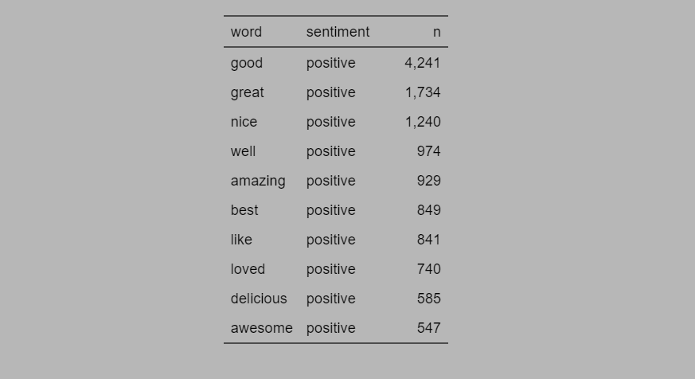
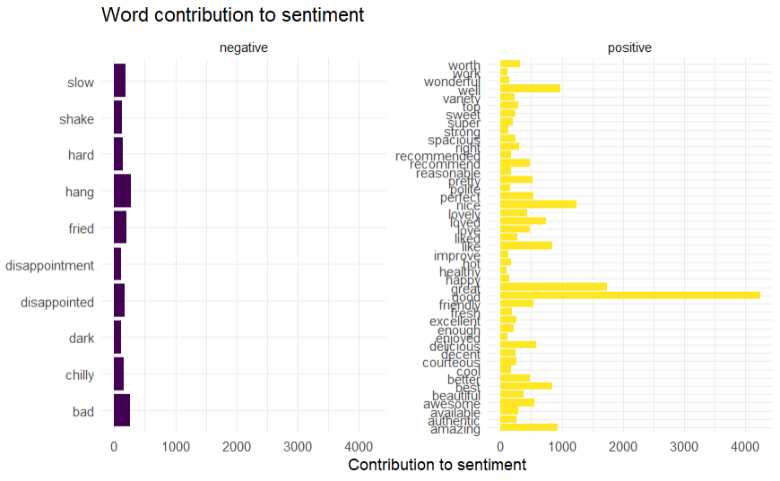
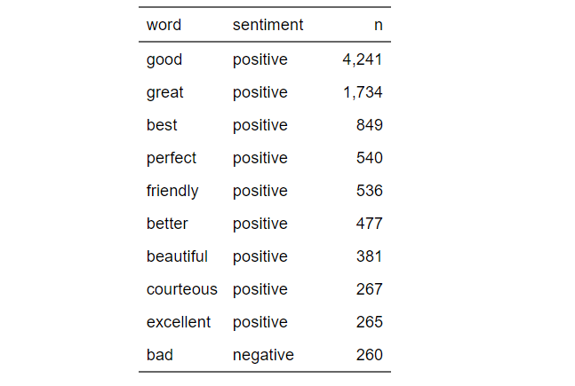
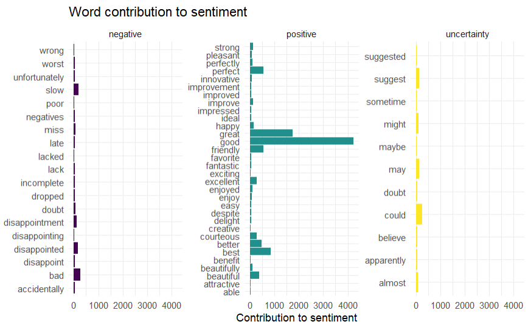

# Sentiment Analysis of Restaurant Reviews

## 📌 Overview

This project explores sentiment and emotion patterns in restaurant reviews using natural language processing (NLP) in **R**. The goal is to extract meaningful emotional insights, identify the most frequent sentiment-bearing words, and understand customer perspectives on food and service quality.

---

## 📂 Dataset

The dataset consists of customer reviews collected from restaurant platforms. I processed, tokenized, and analyzed reviews data using lexicons provided by the `syuzhet` and `textdata` packages.

---

## 🛠️ R Packages Used

- **tidyverse** – Data manipulation and visualization
- **syuzhet** – Sentiment and emotion extraction using NRC lexicon
- **tidytext** – Text tokenization and word frequency analysis
- **textdata** – Lexicon access (e.g., NRC, Bing)
- **dplyr** – Data transformation
- **flextable** – Clean tabular output for reports

---

## 📊 Visualizations and Key Insights

### 1. Analyzing sentiments using the syuzhet package based on the NRC sentiment dictionary

#### Emotion Count Distribution

- **Positive** sentiment dominates the dataset with over 10,000 mentions.
- Other strong emotions include **trust**, **joy**, and **anticipation**.
- Negative emotions like **fear**, **anger**, and **disgust** appear far less frequently, indicating a largely favorable dining experience.

---

### 2. sentiment analysis with the tidytext package using the `bing` lexicon.

#### Top 10 Words in Reviews

Most commonly used positive words:

- `good`, `great`, `nice`, `amazing`, `delicious`, `awesome`
- These reflect satisfaction with food, service, and ambiance.

---

#### Word Contribution to Sentiment (Positive vs. Negative)

- Words like `good`, `great`, `friendly`, and `amazing` had the highest **positive contributions**.
- Words such as `bad`, `disappointment`, and `slow` contributed most to **negative sentiment**, although at much lower magnitudes.

---

### 3. sentiment analysis with the tidytext package using the `loughran` lexicon

#### Top 10 Words in Reviews

A comparison table highlights that **only one negative term ("bad")** appears among the top 10 sentiment words, confirming the skew toward positivity.

---

#### Word Contribution to Sentiment

- **Uncertainty words** (`maybe`, `might`, `could`) show up in a few reviews, possibly indicating suggestions or polite phrasing.
- The majority of reviews are assertively positive.

---

### 📈 Conclusion

The sentiment analysis reveals:

- A **heavily positive** customer sentiment trend
- Frequent use of emotionally strong words like _amazing_, _delicious_, _friendly_
- Limited negative sentiment focused mainly on speed or disappointment
- Slight presence of uncertainty or hedging in tone

This provides restaurant managers valuable insights into what customers appreciate most and where occasional improvements might be needed.

---

### 🔭 Future Enhancements

- Implement **aspect-based sentiment analysis** (e.g., food vs. service vs. ambiance)
- Explore **seasonal or temporal sentiment trends**
- Build an **interactive Shiny dashboard** for real-time review monitoring

---

### 📎 Author: Obadiah Kiptoo

Created using R and tidytext principles. Visualizations generated with `ggplot2` and table summaries formatted with `flextable`.
